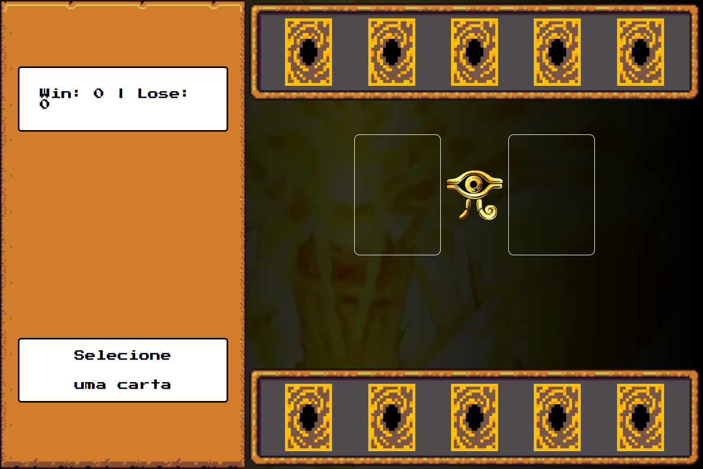

# Yu-Gi-Oh Edição Jo-ken-po

Bem vindo(a) ao resultado do meu segundo desafio na Trilha de Javascript da DIO! Onde construí um jogo de Jo-ken-po (pedra, papel, tesoura) com o tema Yu-Gi-Oh utilizando HTML, CSS e Javascript.

[Clique aqui]() para acessar o resultado final da página criada por mim a partir do desafio da DIO!

